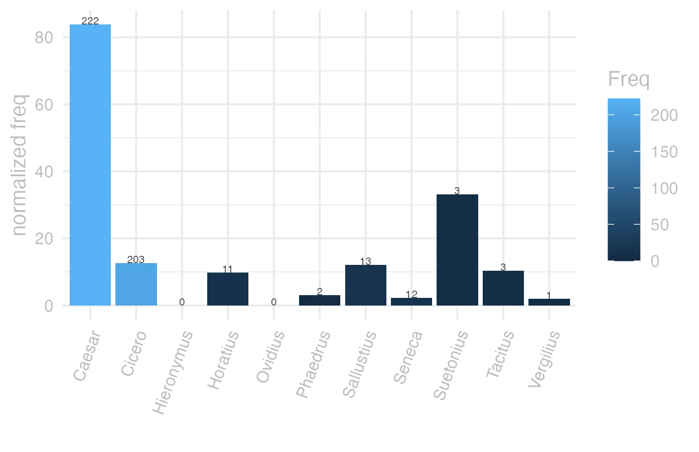
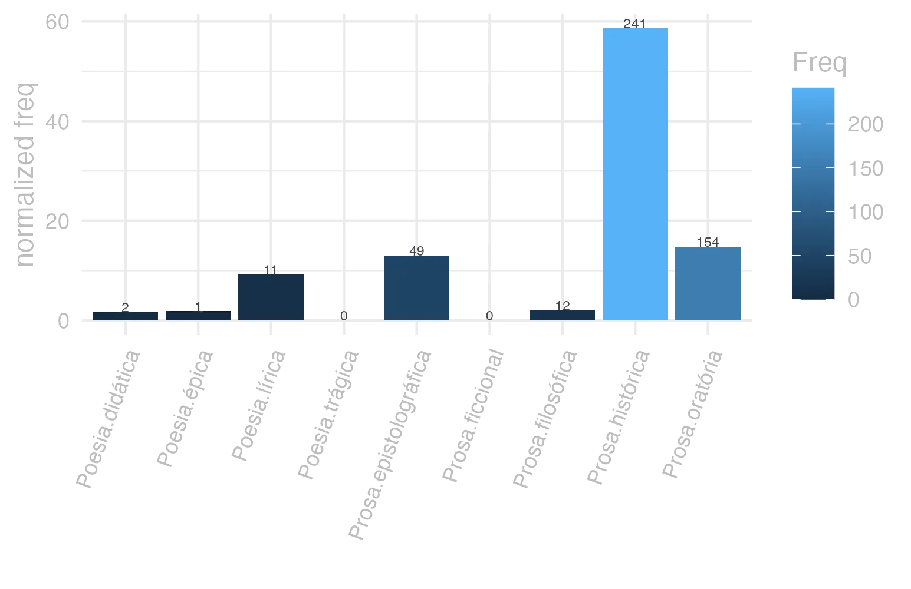
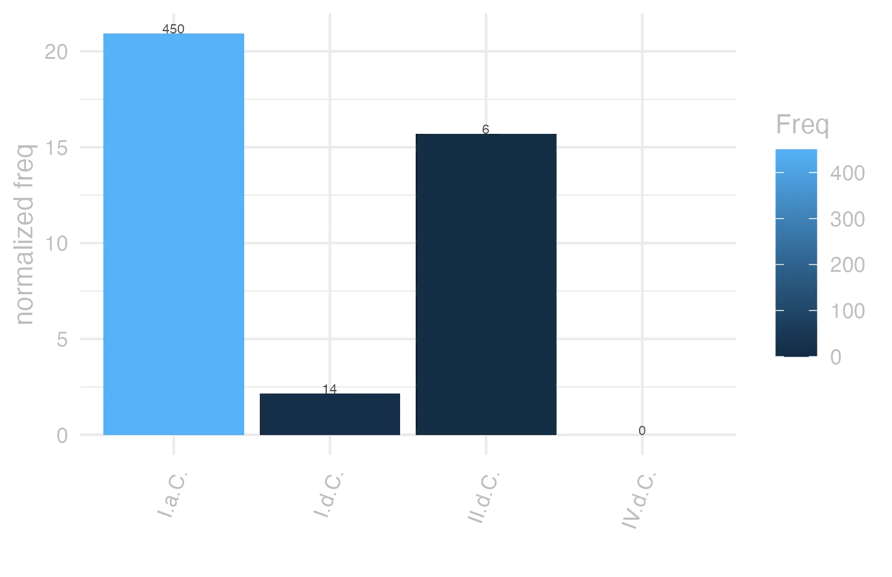

```{r  setUp, include=FALSE}
 library(tidyverse) 

      EntryData <- readRDS(paste0("./", dir("./")[str_detect(dir("./"), "_xx67-97-101-115-97-114xx_.rds")]))

```


#### bases lexicais

&emsp;


::: panel-tabset

#### LiLa Lemma Bank

<small> id: </small> <a href=' http://lila-erc.eu/data/id/lemma/1947 ' target="_blank"> http://lila-erc.eu/data/id/lemma/1947 </a> <br>
<small> classe: </small> nome próprio masculino   <br>
<small> paradigma: </small> 3ª declinação (sem vogal temática) <br>
<small> outras grafias: </small> Cesar <br>
<small> variantes do lema: </small>  <br>


#### PrinParLat

no data


#### Lexicala

<b> Caesăr </b> <br> <b> Caesăris </b> <br />


#### WordNet

no data


:::


#### dicionários tradicionais

&emsp;


::: panel-tabset

#### Faria

<b>Caesar</b> <b>-ăris</b> <br> <small>subs. pr. m.</small> <br> <small></small>   <p> <b>1</b> &ensp; <small></small> &ensp; César, nome de família na “gens” Júlia, da qual Caio Júlio César foi o membro mais proeminente. «Caesar». no Império passou a ser o título dos imperadores romanos. &ensp; <small></small> </p>


#### Saraiva

no data


#### Fonseca

no data


#### Velez

no data


#### Cardoso

no data


:::


#### dados de corpus

&emsp;


::: panel-tabset

#### Possíveis colocados

no data


#### substantivos

no data


#### adjetivos

no data


#### verbos

no data


#### advérbios

no data


#### preposições e conjunções

no data


:::


::: panel-tabset

#### Frequência por autor

{width=100% fig-alt='This charts plots the frequency of lemma by author_Frequencies. The Caesar subcorpus registers the highest normalized frequency, with the value of 83.84 and an absolute frequency of 222. The Seneca subcorpus follows, with a normalized frequency of 2.24 and an absolute frequency of 12. the subcorpus with the least normalized frequency is Ovidius with the normalized value of 0 and an absolute freqeuncy of 0. here are all the values: subcorpus: Caesar ; normalized frequency: 222 ; absolute frequency: 83.8431905733061. subcorpus: Cicero ; normalized frequency: 203 ; absolute frequency: 12.6460840746555. subcorpus: Horatius ; normalized frequency: 11 ; absolute frequency: 9.76822662285765. subcorpus: Ovidius ; normalized frequency: 0 ; absolute frequency: 0. subcorpus: Phaedrus ; normalized frequency: 2 ; absolute frequency: 3.0362835888872. subcorpus: Sallustius ; normalized frequency: 13 ; absolute frequency: 12.0582506261015. subcorpus: Seneca ; normalized frequency: 12 ; absolute frequency: 2.23959985815868. subcorpus: Suetonius ; normalized frequency: 3 ; absolute frequency: 33.0760749724366. subcorpus: Tacitus ; normalized frequency: 3 ; absolute frequency: 10.2986611740474. subcorpus: Vergilius ; normalized frequency: 1 ; absolute frequency: 1.93050193050193. subcorpus: Hieronymus ; normalized frequency: 0 ; absolute frequency: 0'}


#### Frequência por gênero

{width=100% fig-alt='This charts plots the frequency of lemma by genre_Frequencies. The Prosa.histórica subcorpus registers the highest normalized frequency, with the value of 58.67 and an absolute frequency of 241. The Prosa.filosófica subcorpus follows, with a normalized frequency of 1.98 and an absolute frequency of 12. the subcorpus with the least normalized frequency is Poesia.trágica with the normalized value of 0 and an absolute freqeuncy of 0. here are all the values: subcorpus: Prosa.histórica ; normalized frequency: 241 ; absolute frequency: 58.6674456534969. subcorpus: Prosa.filosófica ; normalized frequency: 12 ; absolute frequency: 1.9769031811667. subcorpus: Prosa.oratória ; normalized frequency: 154 ; absolute frequency: 14.7859399153169. subcorpus: Prosa.epistolográfica ; normalized frequency: 49 ; absolute frequency: 12.9839158430271. subcorpus: Poesia.lírica ; normalized frequency: 11 ; absolute frequency: 9.25380667956591. subcorpus: Poesia.didática ; normalized frequency: 2 ; absolute frequency: 1.69649673424379. subcorpus: Poesia.trágica ; normalized frequency: 0 ; absolute frequency: 0. subcorpus: Poesia.épica ; normalized frequency: 1 ; absolute frequency: 1.93050193050193. subcorpus: Prosa.ficcional ; normalized frequency: 0 ; absolute frequency: 0'}


#### Frequência por século

{width=100% fig-alt='This charts plots the frequency of lemma by period_Frequencies. The I.a.C. subcorpus registers the highest normalized frequency, with the value of 20.94 and an absolute frequency of 450. The I.d.C. subcorpus follows, with a normalized frequency of 2.14 and an absolute frequency of 14. the subcorpus with the least normalized frequency is IV.d.C. with the normalized value of 0 and an absolute freqeuncy of 0. here are all the values: subcorpus: I.a.C. ; normalized frequency: 450 ; absolute frequency: 20.9448452408657. subcorpus: I.d.C. ; normalized frequency: 14 ; absolute frequency: 2.14165519351384. subcorpus: II.d.C. ; normalized frequency: 6 ; absolute frequency: 15.7068062827225. subcorpus: IV.d.C. ; normalized frequency: 0 ; absolute frequency: 0'}


#### ExemplosTraduzidos

no data


:::


#### Diagrama de Zipf

no data


