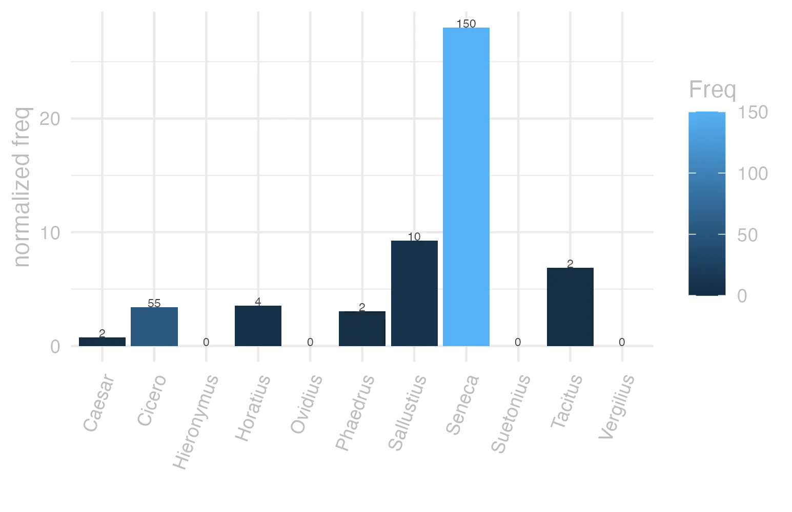
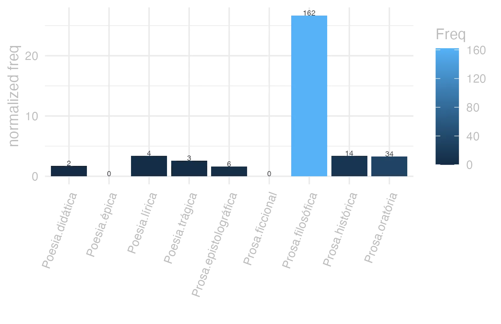
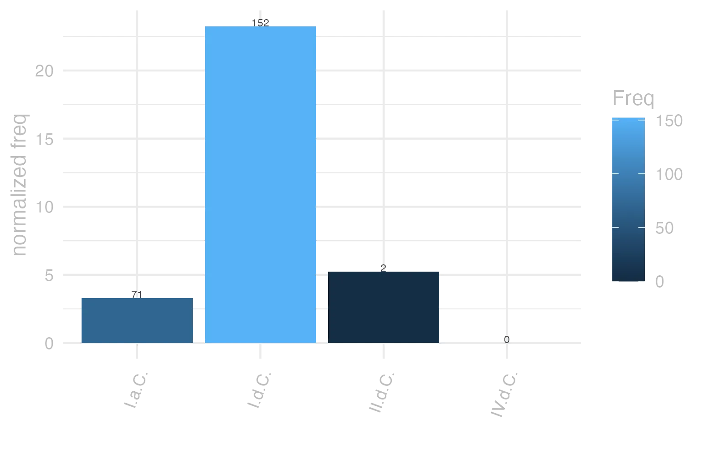

```{r  setUp, include=FALSE}
 library(tidyverse) 

      EntryData <- readRDS(paste0("./", dir("./")[str_detect(dir("./"), "_xx98-111-110-117-109xx_.rds")]))

```


#### bases lexicais

&emsp;


::: panel-tabset

#### LiLa Lemma Bank

<small> id: </small> <a href=' http://lila-erc.eu/data/id/lemma/91351 ' target="_blank"> http://lila-erc.eu/data/id/lemma/91351 </a> <br>
<small> classe: </small> substantivo neutro   <br>
<small> paradigma: </small> 2ª declinação (tema em -o-) <br>
<small> outras grafias: </small> bonom, duonom, duonum <br>
<small> variantes do lema: </small>  <br>


#### PrinParLat

no data


#### Lexicala

<b> bŏnum </b> <br> <b> bŏnī </b> <br />


#### WordNet

no data


:::


#### dicionários tradicionais

&emsp;


::: panel-tabset

#### Faria

<b>bŏnum</b> <b>-ī</b> <br> <small>subs. n.</small> <br> <small></small>   <p> <b>1</b> &ensp; <small>I-Sent. próprio</small> &ensp; Bem &ensp; <small>moral Cíc. De Or. 1, 222.</small> <br> <b>2</b> &ensp; <small>II-Sent. figurado</small> &ensp; Vantagem, utilidade, bom êxito &ensp; <small>Cíc. Br. 123.</small> </p>


#### Saraiva

no data


#### Fonseca

<b>Bonum</b> -<b>i</b> <br> <small>n.</small>   <p> <b>1</b> &ensp; <small>Cic.</small> &ensp; bem, utilidade, proveito, commodo. </p>


#### Velez

no data


#### Cardoso

<b>Bonum</b> <b>i</b>   <p> <b>1</b> &ensp; ho bem </p>


:::


#### dados de corpus

&emsp;


::: panel-tabset

#### Possíveis colocados

no data


#### substantivos

no data


#### adjetivos

no data


#### verbos

no data


#### advérbios

no data


#### preposições e conjunções

no data


:::


::: panel-tabset

#### Frequência por autor

{width=100% fig-alt='This charts plots the frequency of lemma by author_Frequencies. The Seneca subcorpus registers the highest normalized frequency, with the value of 27.99 and an absolute frequency of 150. The Sallustius subcorpus follows, with a normalized frequency of 9.28 and an absolute frequency of 10. the subcorpus with the least normalized frequency is Ovidius with the normalized value of 0 and an absolute freqeuncy of 0. here are all the values: subcorpus: Caesar ; normalized frequency: 2 ; absolute frequency: 0.755344059218974. subcorpus: Cicero ; normalized frequency: 55 ; absolute frequency: 3.42627893648302. subcorpus: Horatius ; normalized frequency: 4 ; absolute frequency: 3.55208240831187. subcorpus: Ovidius ; normalized frequency: 0 ; absolute frequency: 0. subcorpus: Phaedrus ; normalized frequency: 2 ; absolute frequency: 3.0362835888872. subcorpus: Sallustius ; normalized frequency: 10 ; absolute frequency: 9.27557740469344. subcorpus: Seneca ; normalized frequency: 150 ; absolute frequency: 27.9949982269834. subcorpus: Suetonius ; normalized frequency: 0 ; absolute frequency: 0. subcorpus: Tacitus ; normalized frequency: 2 ; absolute frequency: 6.86577411603158. subcorpus: Vergilius ; normalized frequency: 0 ; absolute frequency: 0. subcorpus: Hieronymus ; normalized frequency: 0 ; absolute frequency: 0'}


#### Frequência por gênero

{width=100% fig-alt='This charts plots the frequency of lemma by genre_Frequencies. The Prosa.filosófica subcorpus registers the highest normalized frequency, with the value of 26.69 and an absolute frequency of 162. The Prosa.histórica subcorpus follows, with a normalized frequency of 3.41 and an absolute frequency of 14. the subcorpus with the least normalized frequency is Poesia.épica with the normalized value of 0 and an absolute freqeuncy of 0. here are all the values: subcorpus: Prosa.histórica ; normalized frequency: 14 ; absolute frequency: 3.40806738236082. subcorpus: Prosa.filosófica ; normalized frequency: 162 ; absolute frequency: 26.6881929457505. subcorpus: Prosa.oratória ; normalized frequency: 34 ; absolute frequency: 3.26442829299204. subcorpus: Prosa.epistolográfica ; normalized frequency: 6 ; absolute frequency: 1.58986724608495. subcorpus: Poesia.lírica ; normalized frequency: 4 ; absolute frequency: 3.36502061075124. subcorpus: Poesia.didática ; normalized frequency: 2 ; absolute frequency: 1.69649673424379. subcorpus: Poesia.trágica ; normalized frequency: 3 ; absolute frequency: 2.60597637248089. subcorpus: Poesia.épica ; normalized frequency: 0 ; absolute frequency: 0. subcorpus: Prosa.ficcional ; normalized frequency: 0 ; absolute frequency: 0'}


#### Frequência por século

{width=100% fig-alt='This charts plots the frequency of lemma by period_Frequencies. The I.d.C. subcorpus registers the highest normalized frequency, with the value of 23.25 and an absolute frequency of 152. The I.d.C. subcorpus follows, with a normalized frequency of 23.25 and an absolute frequency of 152. the subcorpus with the least normalized frequency is IV.d.C. with the normalized value of 0 and an absolute freqeuncy of 0. here are all the values: subcorpus: I.a.C. ; normalized frequency: 71 ; absolute frequency: 3.30463113800326. subcorpus: I.d.C. ; normalized frequency: 152 ; absolute frequency: 23.2522563867217. subcorpus: II.d.C. ; normalized frequency: 2 ; absolute frequency: 5.23560209424084. subcorpus: IV.d.C. ; normalized frequency: 0 ; absolute frequency: 0'}


#### ExemplosTraduzidos

no data


:::


#### Diagrama de Zipf

no data


