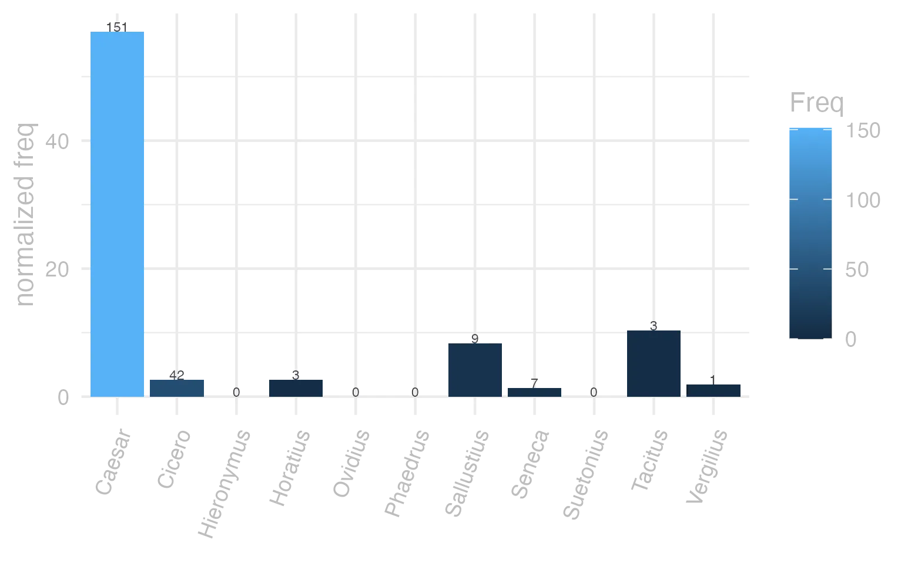
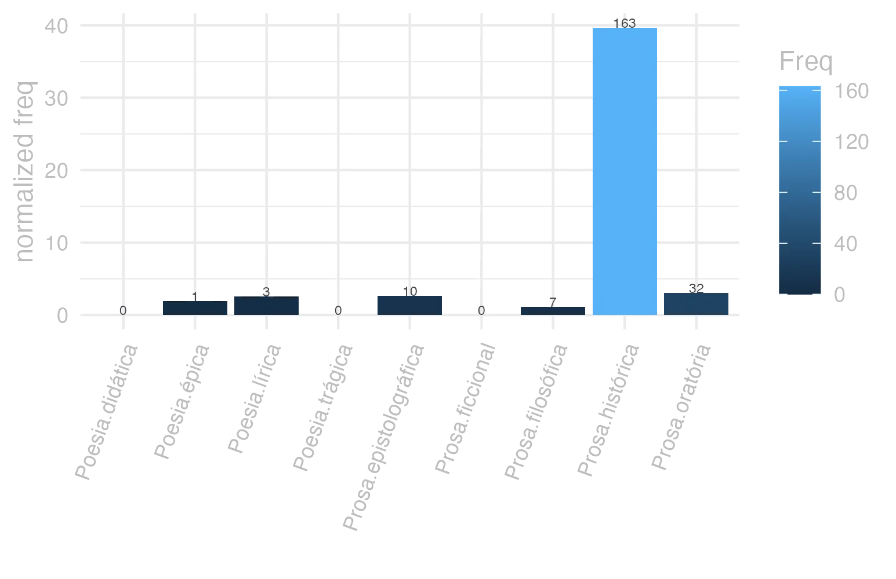
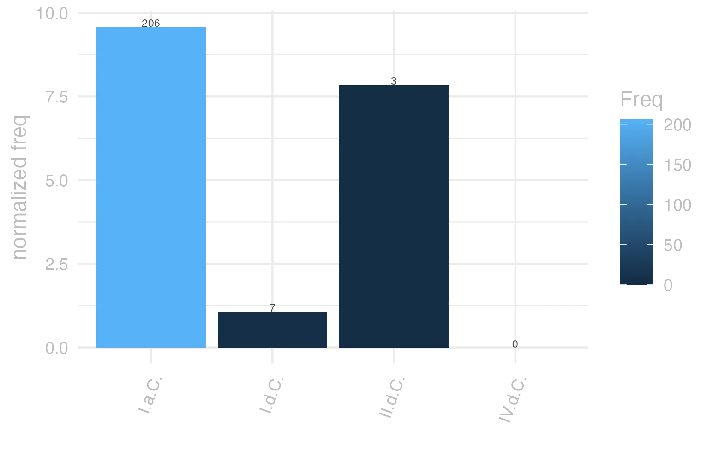

```{r  setUp, include=FALSE}
 library(tidyverse) 

      EntryData <- readRDS(paste0("./", dir("./")[str_detect(dir("./"), "_xx99-97-115-116-114-97xx_.rds")]))

```


#### bases lexicais

&emsp;


::: panel-tabset

#### LiLa Lemma Bank

<small> id: </small> <a href=' http://lila-erc.eu/data/id/lemma/138599 ' target="_blank"> http://lila-erc.eu/data/id/lemma/138599 </a> <br>
<small> classe: </small> substantivo neutro plural  <br>
<small> paradigma: </small> 2ª declinação (tema em -o-) <br>
<small> outras grafias: </small>  <br>
<small> variantes do lema: </small>  <br>


#### PrinParLat

no data


#### Lexicala

<b> castrōrum </b> <br />


#### WordNet

no data


:::


#### dicionários tradicionais

&emsp;


::: panel-tabset

#### Faria

<b>castra</b> <b>-ōrum</b> <br> <small>subs. n. pl.</small> <br> <small>Obs.: Nas duas últimas expressões é comum omitir-se a palavra castra.</small>   <p> <b>1</b> &ensp; <small>I-Sent. próprio</small> &ensp; Acampamento, lugar fortificado, quartel &ensp; <small>de inverno, verão Cés. B. Gal. 1, 48, 1.</small> <br> <b>2</b> &ensp; <small>I-Daí:</small> &ensp; Caserna &ensp; <small>Tác An. 4, 2.</small> <br> <b>3</b> &ensp; <small>II-Sent. figurado:</small> &ensp; Dia de marcha &ensp; <small>Cés. B. Gal. 7, 36, 1.</small> <br> <b>4</b> &ensp; <small>II-Sent. figurado:</small> &ensp; Serviço militar &ensp; <small>Ces. B. Gal. 1, 39, 5.</small> <br> <b>5</b> &ensp; <small>II-Sent. figurado:</small> &ensp; Partido político, escola filosófica: &ensp; <small></small> <br> <b>6</b> &ensp; <small>III-Notem-se as expressões da língua militar:</small> &ensp; <small></small> <br> <b>7</b> &ensp; <small>III-Notem-se as expressões da língua militar:</small> &ensp; <small></small> <br> <b>8</b> &ensp; <small>III-Notem-se as expressões da língua militar:</small> &ensp; <small></small> <br> <b>9</b> &ensp; <small>III-Notem-se as expressões da língua militar:</small> &ensp; <small></small> <br> <b>10</b> &ensp; <small>III-Notem-se as expressões da língua militar:</small> &ensp; <small></small> <br> <b>11</b> &ensp; <small>III-Notem-se as expressões da língua militar:</small> &ensp; <small></small> </p>   <p><small>[EXEMPLOS]</small><br> <br><b>5</b><br>Epicuri castra Cíc. Fam. 9, 20, 1 «a escola de Epicuro». <br> <br><b>6</b><br>«castra movere» Cés. B. Gal. 1, 15, 1 «levantar acampamento». <br> <br><b>7</b><br>«castra munire» Cés. B. Gal. 1, 49, 2 «construir um acampamento». <br> <br><b>8</b><br>«castra ponere» Cés. B. Gal. 1. 22, 5 «assentar acampamento. acampar. <br> <br><b>9</b><br>«castra stativa» Cés. B. Civ. 3. 30. 3 «acampamento permanente». <br> <br><b>10</b><br>«castra aestiva» Tác An. 3, 21 «acampamento de verão, quartel de verão». <br> <br><b>11</b><br>«castra hiberna» T. Lív. 29, 35 «acampamento de inverno». </p>


#### Saraiva

no data


#### Fonseca

<b>Castra</b> -<b>orum</b> <br> <small>n. plur.</small>   <p> <b>1</b> &ensp; <small>Cic.</small> &ensp; arraial, acampamento do exercito. </p>


#### Velez

<b>Castra</b> -<b>orum</b>   <p> <b>1</b> &ensp; os arrayaes </p>


#### Cardoso

<b>Castra</b> <b>orum</b>   <p> <b>1</b> &ensp; ho arrayal de guerra </p>


:::


#### dados de corpus

&emsp;


::: panel-tabset

#### Possíveis colocados

no data


#### substantivos

no data


#### adjetivos

no data


#### verbos

no data


#### advérbios

no data


#### preposições e conjunções

no data


:::


::: panel-tabset

#### Frequência por autor

{width=100% fig-alt='This charts plots the frequency of lemma by author_Frequencies. The Caesar subcorpus registers the highest normalized frequency, with the value of 57.03 and an absolute frequency of 151. The Suetonius subcorpus follows, with a normalized frequency of 0 and an absolute frequency of 0. the subcorpus with the least normalized frequency is Ovidius with the normalized value of 0 and an absolute freqeuncy of 0. here are all the values: subcorpus: Caesar ; normalized frequency: 151 ; absolute frequency: 57.0284764710326. subcorpus: Cicero ; normalized frequency: 42 ; absolute frequency: 2.61643118785976. subcorpus: Horatius ; normalized frequency: 3 ; absolute frequency: 2.6640618062339. subcorpus: Ovidius ; normalized frequency: 0 ; absolute frequency: 0. subcorpus: Phaedrus ; normalized frequency: 0 ; absolute frequency: 0. subcorpus: Sallustius ; normalized frequency: 9 ; absolute frequency: 8.3480196642241. subcorpus: Seneca ; normalized frequency: 7 ; absolute frequency: 1.30643325059256. subcorpus: Suetonius ; normalized frequency: 0 ; absolute frequency: 0. subcorpus: Tacitus ; normalized frequency: 3 ; absolute frequency: 10.2986611740474. subcorpus: Vergilius ; normalized frequency: 1 ; absolute frequency: 1.93050193050193. subcorpus: Hieronymus ; normalized frequency: 0 ; absolute frequency: 0'}


#### Frequência por gênero

{width=100% fig-alt='This charts plots the frequency of lemma by genre_Frequencies. The Prosa.histórica subcorpus registers the highest normalized frequency, with the value of 39.68 and an absolute frequency of 163. The Prosa.filosófica subcorpus follows, with a normalized frequency of 1.15 and an absolute frequency of 7. the subcorpus with the least normalized frequency is Poesia.didática with the normalized value of 0 and an absolute freqeuncy of 0. here are all the values: subcorpus: Prosa.histórica ; normalized frequency: 163 ; absolute frequency: 39.6796416660581. subcorpus: Prosa.filosófica ; normalized frequency: 7 ; absolute frequency: 1.15319352234724. subcorpus: Prosa.oratória ; normalized frequency: 32 ; absolute frequency: 3.07240309928663. subcorpus: Prosa.epistolográfica ; normalized frequency: 10 ; absolute frequency: 2.64977874347492. subcorpus: Poesia.lírica ; normalized frequency: 3 ; absolute frequency: 2.52376545806343. subcorpus: Poesia.didática ; normalized frequency: 0 ; absolute frequency: 0. subcorpus: Poesia.trágica ; normalized frequency: 0 ; absolute frequency: 0. subcorpus: Poesia.épica ; normalized frequency: 1 ; absolute frequency: 1.93050193050193. subcorpus: Prosa.ficcional ; normalized frequency: 0 ; absolute frequency: 0'}


#### Frequência por século

{width=100% fig-alt='This charts plots the frequency of lemma by period_Frequencies. The I.a.C. subcorpus registers the highest normalized frequency, with the value of 9.59 and an absolute frequency of 206. The I.d.C. subcorpus follows, with a normalized frequency of 1.07 and an absolute frequency of 7. the subcorpus with the least normalized frequency is IV.d.C. with the normalized value of 0 and an absolute freqeuncy of 0. here are all the values: subcorpus: I.a.C. ; normalized frequency: 206 ; absolute frequency: 9.58808471026297. subcorpus: I.d.C. ; normalized frequency: 7 ; absolute frequency: 1.07082759675692. subcorpus: II.d.C. ; normalized frequency: 3 ; absolute frequency: 7.85340314136126. subcorpus: IV.d.C. ; normalized frequency: 0 ; absolute frequency: 0'}


#### ExemplosTraduzidos

no data


:::


#### Diagrama de Zipf

no data


