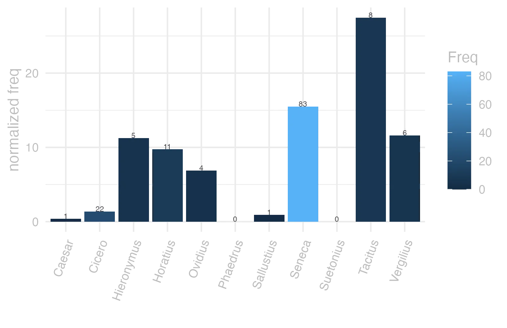
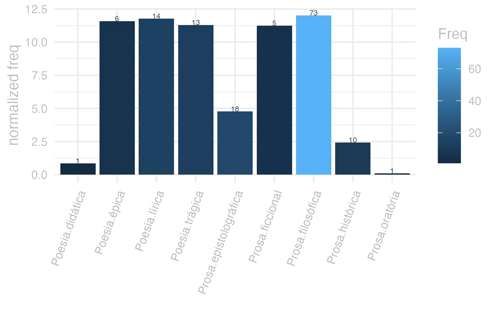
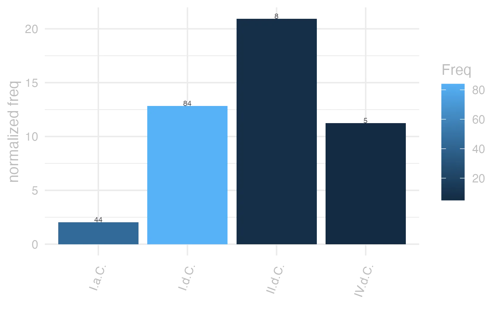

```{r  setUp, include=FALSE}
 library(tidyverse) 

      EntryData <- readRDS(paste0("./", dir("./")[str_detect(dir("./"), "_xx101-116-50xx_.rds")]))

```


#### bases lexicais

&emsp;


::: panel-tabset

#### LiLa Lemma Bank

<small> id: </small> <a href=' http://lila-erc.eu/data/id/lemma/101541 ' target="_blank"> http://lila-erc.eu/data/id/lemma/101541 </a> <br>
<small> classe: </small> advérbio    <br>
<small> paradigma: </small> indeclinável <br>
<small> outras grafias: </small> e, ed, es, id <br>
<small> variantes do lema: </small>  <br>


#### PrinParLat

no data


#### Lexicala

<b> ĕt </b> <br />


#### WordNet

no data


:::


#### dicionários tradicionais

&emsp;


::: panel-tabset

#### Faria

<small>2</small> <b>et</b> <br> <small>adv.</small> <br> <small></small>   <p> <b>1</b> &ensp; <small></small> &ensp; Também, do mesmo modo: &ensp; <small></small> </p>   <p><small>[EXEMPLOS]</small><br> <br><b>1</b><br>gere et tu tuum bene Cíc. Com. 32, “tambem tu, administra bem os teus negócios”. </p>


#### Saraiva

no data


#### Fonseca

<b>Et</b>   <p> <b>2</b> &ensp; ainda. </p>


#### Velez

<b>Et</b>   <p> <b>1</b> &ensp; tambem </p>


#### Cardoso

no data


:::


#### dados de corpus

&emsp;


::: panel-tabset

#### Possíveis colocados

no data


#### substantivos

no data


#### adjetivos

no data


#### verbos

no data


#### advérbios

no data


#### preposições e conjunções

no data


:::


::: panel-tabset

#### Frequência por autor

{width=100% fig-alt='This charts plots the frequency of lemma by author_Frequencies. The Tacitus subcorpus registers the highest normalized frequency, with the value of 27.46 and an absolute frequency of 8. The Seneca subcorpus follows, with a normalized frequency of 15.49 and an absolute frequency of 83. the subcorpus with the least normalized frequency is Phaedrus with the normalized value of 0 and an absolute freqeuncy of 0. here are all the values: subcorpus: Caesar ; normalized frequency: 1 ; absolute frequency: 0.377672029609487. subcorpus: Cicero ; normalized frequency: 22 ; absolute frequency: 1.37051157459321. subcorpus: Horatius ; normalized frequency: 11 ; absolute frequency: 9.76822662285765. subcorpus: Ovidius ; normalized frequency: 4 ; absolute frequency: 6.86341798215511. subcorpus: Phaedrus ; normalized frequency: 0 ; absolute frequency: 0. subcorpus: Sallustius ; normalized frequency: 1 ; absolute frequency: 0.927557740469344. subcorpus: Seneca ; normalized frequency: 83 ; absolute frequency: 15.4905656855975. subcorpus: Suetonius ; normalized frequency: 0 ; absolute frequency: 0. subcorpus: Tacitus ; normalized frequency: 8 ; absolute frequency: 27.4630964641263. subcorpus: Vergilius ; normalized frequency: 6 ; absolute frequency: 11.5830115830116. subcorpus: Hieronymus ; normalized frequency: 5 ; absolute frequency: 11.2334306897326'}


#### Frequência por gênero

{width=100% fig-alt='This charts plots the frequency of lemma by genre_Frequencies. The Prosa.filosófica subcorpus registers the highest normalized frequency, with the value of 12.03 and an absolute frequency of 73. The Prosa.epistolográfica subcorpus follows, with a normalized frequency of 4.77 and an absolute frequency of 18. the subcorpus with the least normalized frequency is Prosa.oratória with the normalized value of 0.1 and an absolute freqeuncy of 1. here are all the values: subcorpus: Prosa.histórica ; normalized frequency: 10 ; absolute frequency: 2.43433384454344. subcorpus: Prosa.filosófica ; normalized frequency: 73 ; absolute frequency: 12.0261610187641. subcorpus: Prosa.oratória ; normalized frequency: 1 ; absolute frequency: 0.0960125968527071. subcorpus: Prosa.epistolográfica ; normalized frequency: 18 ; absolute frequency: 4.76960173825486. subcorpus: Poesia.lírica ; normalized frequency: 14 ; absolute frequency: 11.7775721376293. subcorpus: Poesia.didática ; normalized frequency: 1 ; absolute frequency: 0.848248367121893. subcorpus: Poesia.trágica ; normalized frequency: 13 ; absolute frequency: 11.2925642807505. subcorpus: Poesia.épica ; normalized frequency: 6 ; absolute frequency: 11.5830115830116. subcorpus: Prosa.ficcional ; normalized frequency: 5 ; absolute frequency: 11.2334306897326'}


#### Frequência por século

{width=100% fig-alt='This charts plots the frequency of lemma by period_Frequencies. The II.d.C. subcorpus registers the highest normalized frequency, with the value of 20.94 and an absolute frequency of 8. The I.d.C. subcorpus follows, with a normalized frequency of 12.85 and an absolute frequency of 84. the subcorpus with the least normalized frequency is I.a.C. with the normalized value of 2.05 and an absolute freqeuncy of 44. here are all the values: subcorpus: I.a.C. ; normalized frequency: 44 ; absolute frequency: 2.04794042355132. subcorpus: I.d.C. ; normalized frequency: 84 ; absolute frequency: 12.8499311610831. subcorpus: II.d.C. ; normalized frequency: 8 ; absolute frequency: 20.9424083769633. subcorpus: IV.d.C. ; normalized frequency: 5 ; absolute frequency: 11.2334306897326'}


#### ExemplosTraduzidos

no data


:::


#### Diagrama de Zipf

no data


