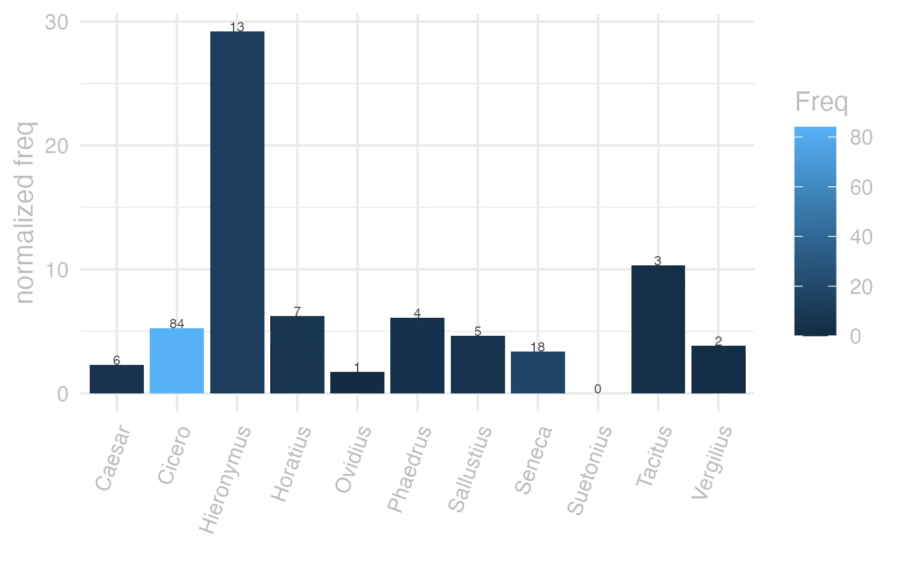
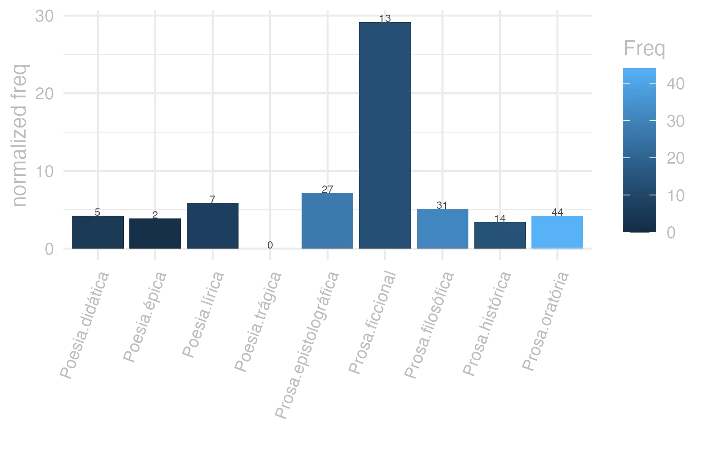
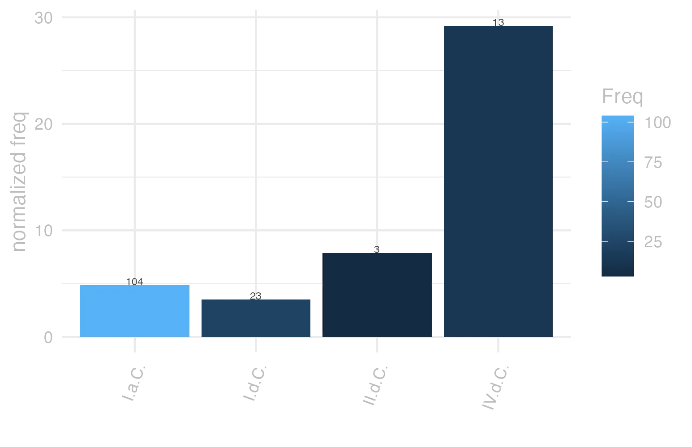

```{r  setUp, include=FALSE}
 library(tidyverse) 

      EntryData <- readRDS(paste0("./", dir("./")[str_detect(dir("./"), "_xx102-105-108-105-117-115xx_.rds")]))

```


#### bases lexicais

&emsp;


::: panel-tabset

#### LiLa Lemma Bank

<small> id: </small> <a href=' http://lila-erc.eu/data/id/lemma/103307 ' target="_blank"> http://lila-erc.eu/data/id/lemma/103307 </a> <br>
<small> classe: </small> substantivo masculino   <br>
<small> paradigma: </small> 2ª declinação (tema em -o-) <br>
<small> outras grafias: </small> philius <br>
<small> variantes do lema: </small>  <br>


#### PrinParLat

no data


#### Lexicala

<b> fīlĭus </b> <br> <b> fīlĭī </b> <br />


#### WordNet

no data


:::


#### dicionários tradicionais

&emsp;


::: panel-tabset

#### Faria

<b>filĭus</b> <b>-ī</b> <br> <small>subs. m.</small> <br> <small>Voc. fili.</small>   <p> <b>1</b> &ensp; <small>I-Sent. próprio</small> &ensp; Crianças de peito, e daí: filho &ensp; <small>Hor. Sát. 2, 6, 49.</small> <br> <b>2</b> &ensp; <small>II-No pl.</small> &ensp; Filhos &ensp; <small>de ambos os sexos Cíc. ad Br. I, 12, 2.</small> <br> <b>3</b> &ensp; <small>II-No pl.</small> &ensp; Filhos dos animais &ensp; <small>sent. raro Col. 6, 37, 4.</small> </p>


#### Saraiva

no data


#### Fonseca

<b>Filius</b> -<b>ii</b> <br> <small>m.</small>   <p> <b>1</b> &ensp; <small>Cic.</small> &ensp; filho. </p>


#### Velez

<b>Filius</b> -<b>ii</b> <br> <small>Nomine filiorum etiam filiae continentur, non e contrario.</small>   <p> <b>1</b> &ensp; o filho </p>   <p><small>[EXEMPLOS]</small><br> <br><b>X</b><br>fortunae filius &ensp; <small><small>cui omnia prosperè succedunt</small></small> <br> fratris filius &ensp; <small>o sobrinho</small> <br> terrae filii &ensp; <small><small>i, obscuro, ignotoque nati genere</small></small> </p>


#### Cardoso

<b>Filius</b> <b>ij</b>   <p> <b>1</b> &ensp; ho filho </p>


:::


#### dados de corpus

&emsp;


::: panel-tabset

#### Possíveis colocados

no data


#### substantivos

no data


#### adjetivos

no data


#### verbos

no data


#### advérbios

no data


#### preposições e conjunções

no data


:::


::: panel-tabset

#### Frequência por autor

{width=100% fig-alt='This charts plots the frequency of lemma by author_Frequencies. The Hieronymus subcorpus registers the highest normalized frequency, with the value of 29.21 and an absolute frequency of 13. The Tacitus subcorpus follows, with a normalized frequency of 10.3 and an absolute frequency of 3. the subcorpus with the least normalized frequency is Suetonius with the normalized value of 0 and an absolute freqeuncy of 0. here are all the values: subcorpus: Caesar ; normalized frequency: 6 ; absolute frequency: 2.26603217765692. subcorpus: Cicero ; normalized frequency: 84 ; absolute frequency: 5.23286237571952. subcorpus: Horatius ; normalized frequency: 7 ; absolute frequency: 6.21614421454578. subcorpus: Ovidius ; normalized frequency: 1 ; absolute frequency: 1.71585449553878. subcorpus: Phaedrus ; normalized frequency: 4 ; absolute frequency: 6.0725671777744. subcorpus: Sallustius ; normalized frequency: 5 ; absolute frequency: 4.63778870234672. subcorpus: Seneca ; normalized frequency: 18 ; absolute frequency: 3.35939978723801. subcorpus: Suetonius ; normalized frequency: 0 ; absolute frequency: 0. subcorpus: Tacitus ; normalized frequency: 3 ; absolute frequency: 10.2986611740474. subcorpus: Vergilius ; normalized frequency: 2 ; absolute frequency: 3.86100386100386. subcorpus: Hieronymus ; normalized frequency: 13 ; absolute frequency: 29.2069197933049'}


#### Frequência por gênero

{width=100% fig-alt='This charts plots the frequency of lemma by genre_Frequencies. The Prosa.ficcional subcorpus registers the highest normalized frequency, with the value of 29.21 and an absolute frequency of 13. The Prosa.epistolográfica subcorpus follows, with a normalized frequency of 7.15 and an absolute frequency of 27. the subcorpus with the least normalized frequency is Poesia.trágica with the normalized value of 0 and an absolute freqeuncy of 0. here are all the values: subcorpus: Prosa.histórica ; normalized frequency: 14 ; absolute frequency: 3.40806738236082. subcorpus: Prosa.filosófica ; normalized frequency: 31 ; absolute frequency: 5.10699988468065. subcorpus: Prosa.oratória ; normalized frequency: 44 ; absolute frequency: 4.22455426151911. subcorpus: Prosa.epistolográfica ; normalized frequency: 27 ; absolute frequency: 7.15440260738228. subcorpus: Poesia.lírica ; normalized frequency: 7 ; absolute frequency: 5.88878606881467. subcorpus: Poesia.didática ; normalized frequency: 5 ; absolute frequency: 4.24124183560947. subcorpus: Poesia.trágica ; normalized frequency: 0 ; absolute frequency: 0. subcorpus: Poesia.épica ; normalized frequency: 2 ; absolute frequency: 3.86100386100386. subcorpus: Prosa.ficcional ; normalized frequency: 13 ; absolute frequency: 29.2069197933049'}


#### Frequência por século

{width=100% fig-alt='This charts plots the frequency of lemma by period_Frequencies. The IV.d.C. subcorpus registers the highest normalized frequency, with the value of 29.21 and an absolute frequency of 13. The II.d.C. subcorpus follows, with a normalized frequency of 7.85 and an absolute frequency of 3. the subcorpus with the least normalized frequency is I.d.C. with the normalized value of 3.52 and an absolute freqeuncy of 23. here are all the values: subcorpus: I.a.C. ; normalized frequency: 104 ; absolute frequency: 4.84058645566674. subcorpus: I.d.C. ; normalized frequency: 23 ; absolute frequency: 3.51843353220132. subcorpus: II.d.C. ; normalized frequency: 3 ; absolute frequency: 7.85340314136126. subcorpus: IV.d.C. ; normalized frequency: 13 ; absolute frequency: 29.2069197933049'}


#### ExemplosTraduzidos

no data


:::


#### Diagrama de Zipf

no data


