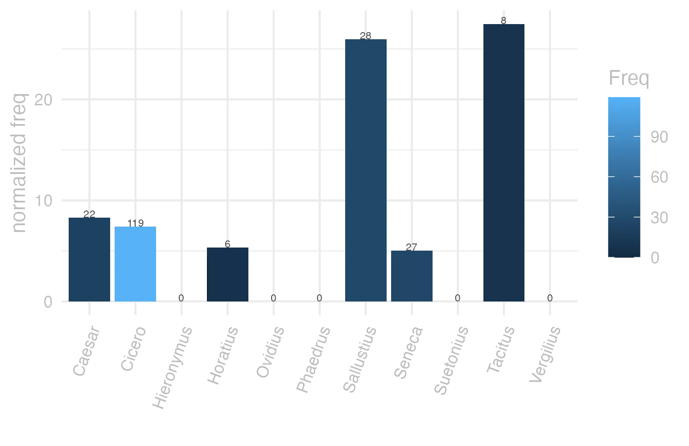
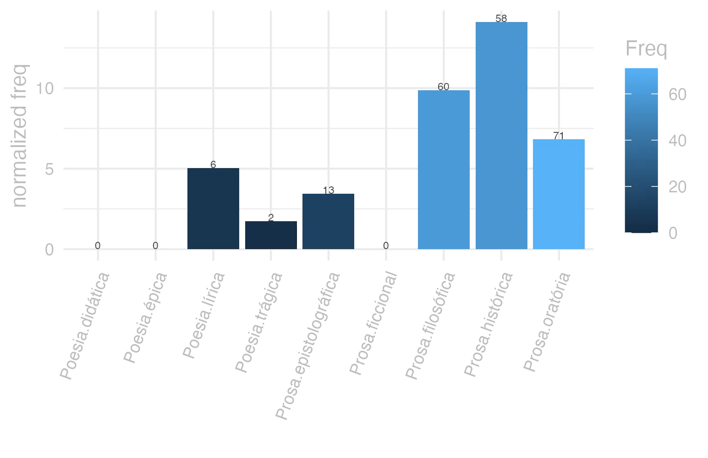
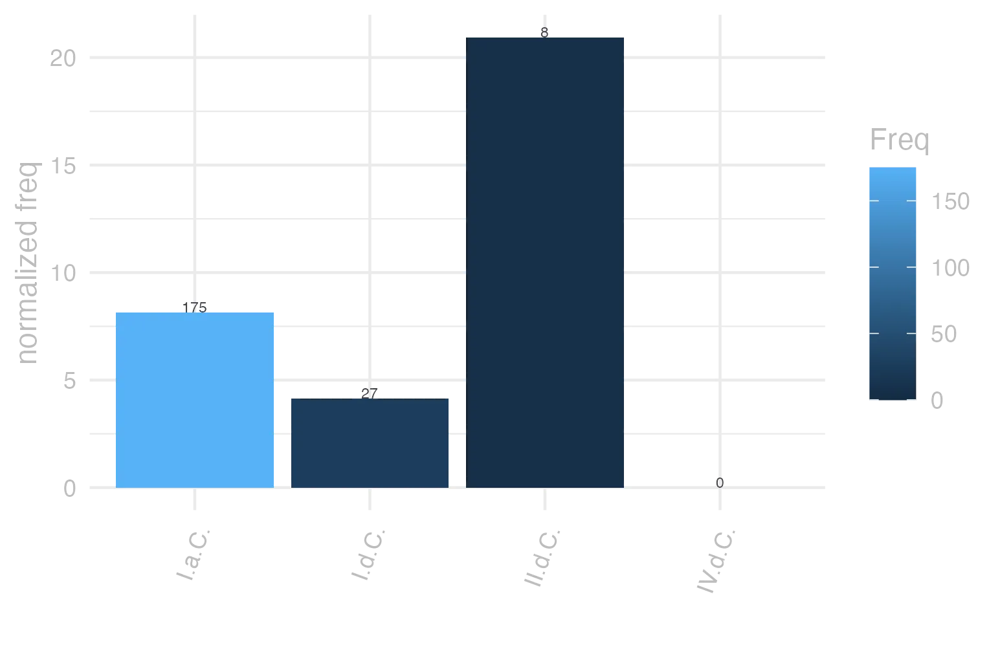

```{r  setUp, include=FALSE}
 library(tidyverse) 

      EntryData <- readRDS(paste0("./", dir("./")[str_detect(dir("./"), "_xx113-117-105-115-113-117-101xx_.rds")]))

```


#### bases lexicais

&emsp;


::: panel-tabset

#### LiLa Lemma Bank

<small> id: </small> <a href=' http://lila-erc.eu/data/id/lemma/121320 ' target="_blank"> http://lila-erc.eu/data/id/lemma/121320 </a> <br>
<small> classe: </small> determinante    <br>
<small> paradigma: </small> pronominal <br>
<small> outras grafias: </small>  <br>
<small> variantes do lema: </small>  <br>


#### PrinParLat

no data


#### Lexicala

<b> quisquĕ </b> <br> <b> quaequĕ </b> <br> <b> quidquĕ </b> <br />


#### WordNet

no data


:::


#### dicionários tradicionais

&emsp;


::: panel-tabset

#### Faria

<b>quidque</b> <br> <small></small> <br> <small>v. quisque.</small> 
 <b>quisque</b> <b>quaeque, quodque e quidque ou quicque</b> <br> <small>pron. indef.</small> <br> <small></small>   <p> <b>1</b> &ensp; <small></small> &ensp; Cada um, cada: &ensp; <small></small> <br> <b>2</b> &ensp; <small></small> &ensp; Cada um de dois, ambos &ensp; <small>Ov. F. 2, 715.</small> <br> <b>3</b> &ensp; <small>= quicumque</small> &ensp; todo aquele que &ensp; <small>T. Lív. 1, 24, 3.</small> <br> <b>4</b> &ensp; <small>Em locuções:</small> &ensp; <small></small> </p>   <p><small>[EXEMPLOS]</small><br> <br><b>1</b><br>pro se quisque Cíc. Verr. 1, 68 “cada um por si”, i. e., por sua conta. <br> <br><b>4</b><br>quinto quoque anno Cíc. Verr. 2, 139 ‘cada cinco anos’, i. e., de cinco em cinco anos; primo quoque tempora Cíc. Phil. 3, 39 “logo que seja possível, na primeira ocasião”: cosilia cujusque modi Cés. B. Gal. 7, 22, 1 “disposições tomadas de uma maneira ou de outra”. </p> 
 <small>1</small> <b>quōque</b> <br> <small>abl. de quisque.</small> <br> <small></small>


#### Saraiva

no data


#### Fonseca

<b>Quisque</b> <b>quaeque</b> <b>quodque</b> <b>quidque</b> <small>l</small>   <p> <b>1</b> &ensp; <small>Cic.</small> &ensp; qualquer. <br> <b>2</b> &ensp; cada hum. </p>


#### Velez

no data


#### Cardoso

<b>Quisque</b> <br> <small>semper cũ superlatiuo.</small>   <p> <b>1</b> &ensp; qualquer </p>


:::


#### dados de corpus

&emsp;


::: panel-tabset

#### Possíveis colocados

no data


#### substantivos

no data


#### adjetivos

no data


#### verbos

no data


#### advérbios

no data


#### preposições e conjunções

no data


:::


::: panel-tabset

#### Frequência por autor

{width=100% fig-alt='This charts plots the frequency of lemma by author_Frequencies. The Tacitus subcorpus registers the highest normalized frequency, with the value of 27.46 and an absolute frequency of 8. The Sallustius subcorpus follows, with a normalized frequency of 25.97 and an absolute frequency of 28. the subcorpus with the least normalized frequency is Ovidius with the normalized value of 0 and an absolute freqeuncy of 0. here are all the values: subcorpus: Caesar ; normalized frequency: 22 ; absolute frequency: 8.30878465140872. subcorpus: Cicero ; normalized frequency: 119 ; absolute frequency: 7.41322169893598. subcorpus: Horatius ; normalized frequency: 6 ; absolute frequency: 5.32812361246781. subcorpus: Ovidius ; normalized frequency: 0 ; absolute frequency: 0. subcorpus: Phaedrus ; normalized frequency: 0 ; absolute frequency: 0. subcorpus: Sallustius ; normalized frequency: 28 ; absolute frequency: 25.9716167331416. subcorpus: Seneca ; normalized frequency: 27 ; absolute frequency: 5.03909968085702. subcorpus: Suetonius ; normalized frequency: 0 ; absolute frequency: 0. subcorpus: Tacitus ; normalized frequency: 8 ; absolute frequency: 27.4630964641263. subcorpus: Vergilius ; normalized frequency: 0 ; absolute frequency: 0. subcorpus: Hieronymus ; normalized frequency: 0 ; absolute frequency: 0'}


#### Frequência por gênero

{width=100% fig-alt='This charts plots the frequency of lemma by genre_Frequencies. The Prosa.histórica subcorpus registers the highest normalized frequency, with the value of 14.12 and an absolute frequency of 58. The Prosa.histórica subcorpus follows, with a normalized frequency of 14.12 and an absolute frequency of 58. the subcorpus with the least normalized frequency is Poesia.didática with the normalized value of 0 and an absolute freqeuncy of 0. here are all the values: subcorpus: Prosa.histórica ; normalized frequency: 58 ; absolute frequency: 14.119136298352. subcorpus: Prosa.filosófica ; normalized frequency: 60 ; absolute frequency: 9.88451590583351. subcorpus: Prosa.oratória ; normalized frequency: 71 ; absolute frequency: 6.8168943765422. subcorpus: Prosa.epistolográfica ; normalized frequency: 13 ; absolute frequency: 3.4447123665174. subcorpus: Poesia.lírica ; normalized frequency: 6 ; absolute frequency: 5.04753091612686. subcorpus: Poesia.didática ; normalized frequency: 0 ; absolute frequency: 0. subcorpus: Poesia.trágica ; normalized frequency: 2 ; absolute frequency: 1.73731758165393. subcorpus: Poesia.épica ; normalized frequency: 0 ; absolute frequency: 0. subcorpus: Prosa.ficcional ; normalized frequency: 0 ; absolute frequency: 0'}


#### Frequência por século

{width=100% fig-alt='This charts plots the frequency of lemma by period_Frequencies. The II.d.C. subcorpus registers the highest normalized frequency, with the value of 20.94 and an absolute frequency of 8. The I.a.C. subcorpus follows, with a normalized frequency of 8.15 and an absolute frequency of 175. the subcorpus with the least normalized frequency is IV.d.C. with the normalized value of 0 and an absolute freqeuncy of 0. here are all the values: subcorpus: I.a.C. ; normalized frequency: 175 ; absolute frequency: 8.14521759367. subcorpus: I.d.C. ; normalized frequency: 27 ; absolute frequency: 4.13033501606241. subcorpus: II.d.C. ; normalized frequency: 8 ; absolute frequency: 20.9424083769633. subcorpus: IV.d.C. ; normalized frequency: 0 ; absolute frequency: 0'}


#### ExemplosTraduzidos

no data


:::


#### Diagrama de Zipf

no data


