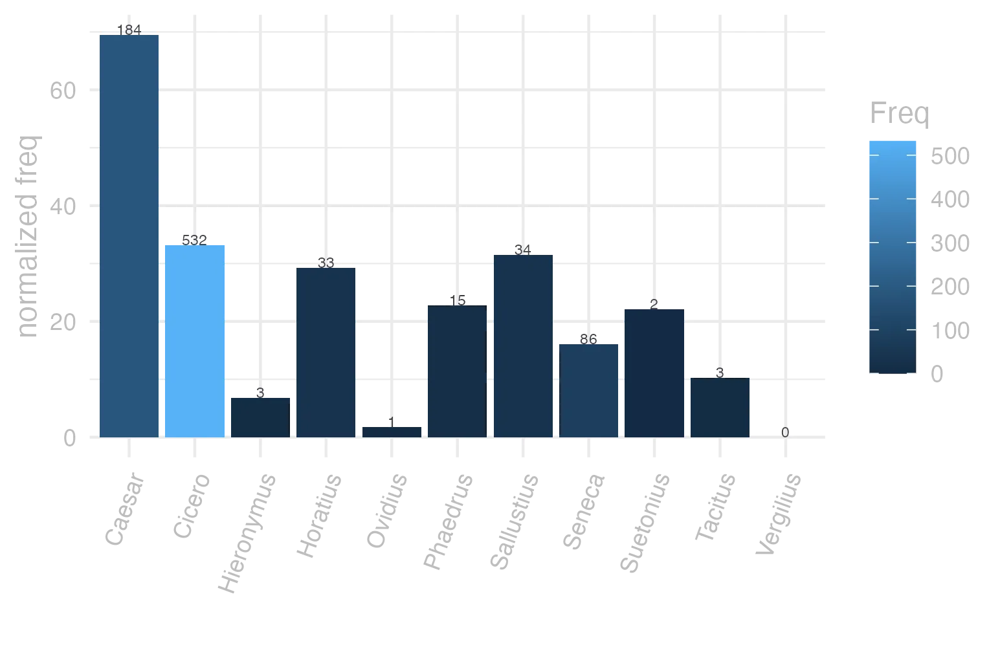
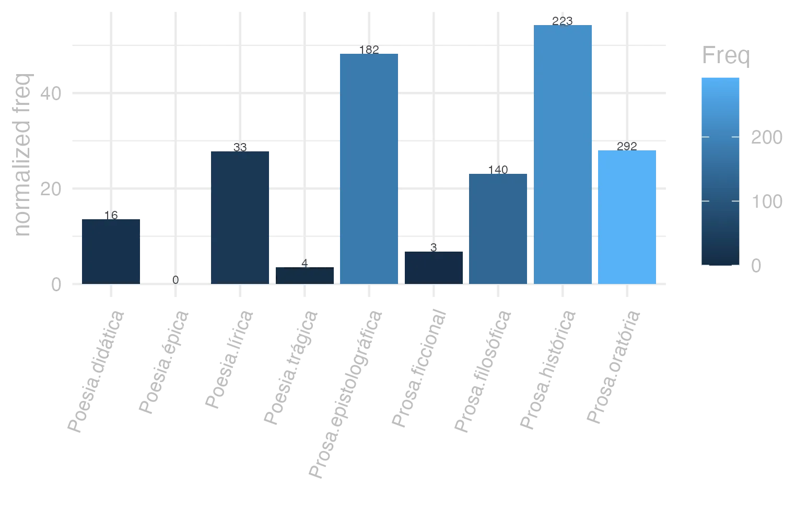
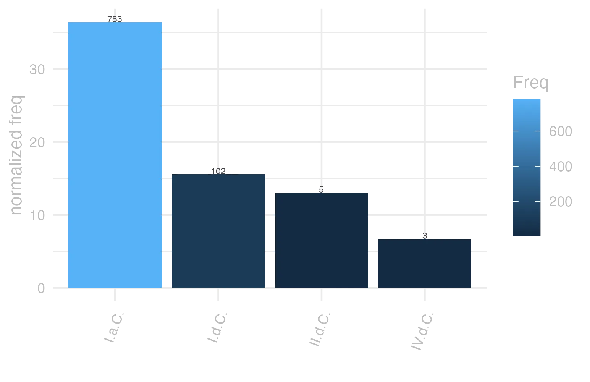

```{r  setUp, include=FALSE}
 library(tidyverse) 

      EntryData <- readRDS(paste0("./", dir("./")[str_detect(dir("./"), "_xx113-117-111-100xx_.rds")]))

```


#### bases lexicais

&emsp;


::: panel-tabset

#### LiLa Lemma Bank

<small> id: </small> <a href=' http://lila-erc.eu/data/id/lemma/74854 ' target="_blank"> http://lila-erc.eu/data/id/lemma/74854 </a> <br>
<small> classe: </small> conjunção subordinativa    <br>
<small> paradigma: </small> indeclinável <br>
<small> outras grafias: </small>  <br>
<small> variantes do lema: </small>  <br>


#### PrinParLat

no data


#### Lexicala

<b> quŏd </b> <br />


#### WordNet

no data


:::


#### dicionários tradicionais

&emsp;


::: panel-tabset

#### Faria

no data


#### Saraiva

no data


#### Fonseca

<b>Quod</b> <br> <small>conj.</small>   <p> <b>1</b> &ensp; <small>Cic.</small> &ensp; porque, que, para que, por quanto, mais quanto. </p>


#### Velez

<b>Quod</b> <br> <small>Conj.</small>   <p> <b>1</b> &ensp; porque <br> <b>2</b> &ensp; <small>in principio clausulae ponitur pro Sed</small> </p>   <p><small>[EXEMPLOS]</small><br> <br><b>2</b><br>quod si &ensp; <small>mas se</small> </p>


#### Cardoso

no data


:::


#### dados de corpus

&emsp;


::: panel-tabset

#### Possíveis colocados

no data


#### substantivos

no data


#### adjetivos

no data


#### verbos

no data


#### advérbios

no data


#### preposições e conjunções

no data


:::


::: panel-tabset

#### Frequência por autor

{width=100% fig-alt='This charts plots the frequency of lemma by author_Frequencies. The Caesar subcorpus registers the highest normalized frequency, with the value of 69.49 and an absolute frequency of 184. The Caesar subcorpus follows, with a normalized frequency of 69.49 and an absolute frequency of 184. the subcorpus with the least normalized frequency is Vergilius with the normalized value of 0 and an absolute freqeuncy of 0. here are all the values: subcorpus: Caesar ; normalized frequency: 184 ; absolute frequency: 69.4916534481456. subcorpus: Cicero ; normalized frequency: 532 ; absolute frequency: 33.1414617128903. subcorpus: Horatius ; normalized frequency: 33 ; absolute frequency: 29.304679868573. subcorpus: Ovidius ; normalized frequency: 1 ; absolute frequency: 1.71585449553878. subcorpus: Phaedrus ; normalized frequency: 15 ; absolute frequency: 22.772126916654. subcorpus: Sallustius ; normalized frequency: 34 ; absolute frequency: 31.5369631759577. subcorpus: Seneca ; normalized frequency: 86 ; absolute frequency: 16.0504656501372. subcorpus: Suetonius ; normalized frequency: 2 ; absolute frequency: 22.0507166482911. subcorpus: Tacitus ; normalized frequency: 3 ; absolute frequency: 10.2986611740474. subcorpus: Vergilius ; normalized frequency: 0 ; absolute frequency: 0. subcorpus: Hieronymus ; normalized frequency: 3 ; absolute frequency: 6.74005841383959'}


#### Frequência por gênero

{width=100% fig-alt='This charts plots the frequency of lemma by genre_Frequencies. The Prosa.histórica subcorpus registers the highest normalized frequency, with the value of 54.29 and an absolute frequency of 223. The Prosa.oratória subcorpus follows, with a normalized frequency of 28.04 and an absolute frequency of 292. the subcorpus with the least normalized frequency is Poesia.épica with the normalized value of 0 and an absolute freqeuncy of 0. here are all the values: subcorpus: Prosa.histórica ; normalized frequency: 223 ; absolute frequency: 54.2856447333187. subcorpus: Prosa.filosófica ; normalized frequency: 140 ; absolute frequency: 23.0638704469449. subcorpus: Prosa.oratória ; normalized frequency: 292 ; absolute frequency: 28.0356782809905. subcorpus: Prosa.epistolográfica ; normalized frequency: 182 ; absolute frequency: 48.2259731312435. subcorpus: Poesia.lírica ; normalized frequency: 33 ; absolute frequency: 27.7614200386977. subcorpus: Poesia.didática ; normalized frequency: 16 ; absolute frequency: 13.5719738739503. subcorpus: Poesia.trágica ; normalized frequency: 4 ; absolute frequency: 3.47463516330785. subcorpus: Poesia.épica ; normalized frequency: 0 ; absolute frequency: 0. subcorpus: Prosa.ficcional ; normalized frequency: 3 ; absolute frequency: 6.74005841383959'}


#### Frequência por século

{width=100% fig-alt='This charts plots the frequency of lemma by period_Frequencies. The I.a.C. subcorpus registers the highest normalized frequency, with the value of 36.44 and an absolute frequency of 783. The I.a.C. subcorpus follows, with a normalized frequency of 36.44 and an absolute frequency of 783. the subcorpus with the least normalized frequency is IV.d.C. with the normalized value of 6.74 and an absolute freqeuncy of 3. here are all the values: subcorpus: I.a.C. ; normalized frequency: 783 ; absolute frequency: 36.4440307191064. subcorpus: I.d.C. ; normalized frequency: 102 ; absolute frequency: 15.603487838458. subcorpus: II.d.C. ; normalized frequency: 5 ; absolute frequency: 13.0890052356021. subcorpus: IV.d.C. ; normalized frequency: 3 ; absolute frequency: 6.74005841383959'}


#### ExemplosTraduzidos

no data


:::


#### Diagrama de Zipf

no data


