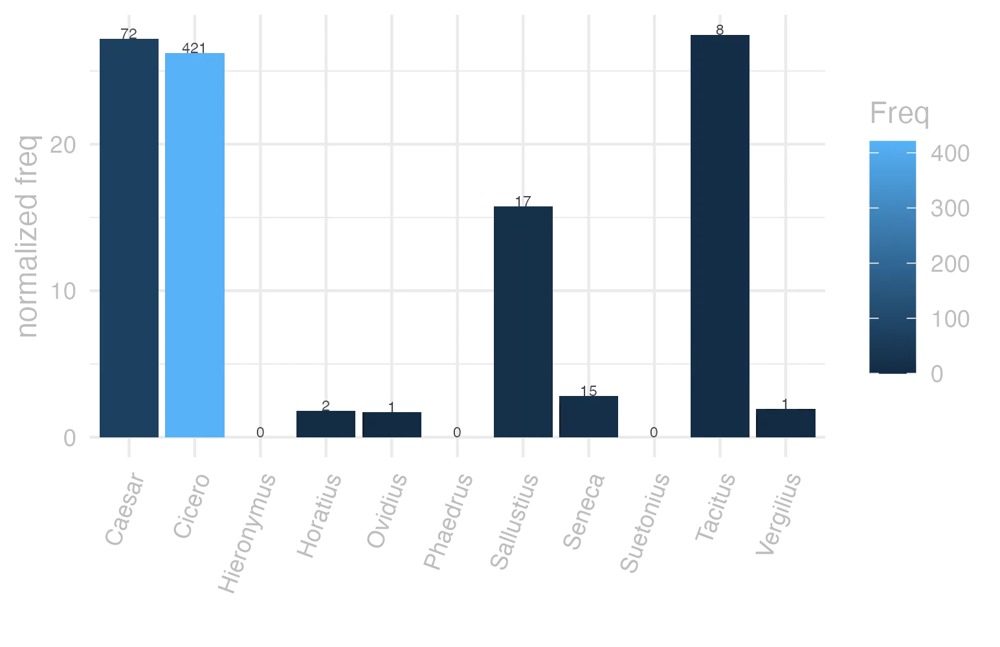
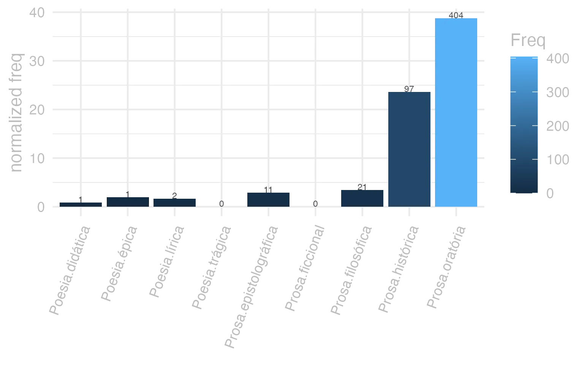
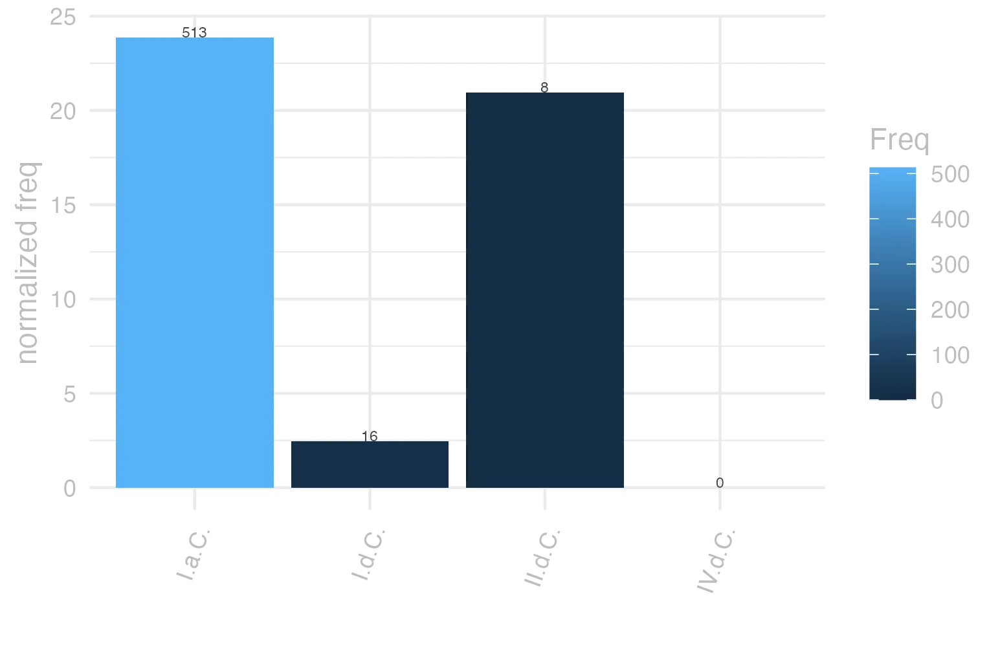

```{r  setUp, include=FALSE}
 library(tidyverse) 

      EntryData <- readRDS(paste0("./", dir("./")[str_detect(dir("./"), "_xx114-111-109-97-110-117-115xx_.rds")]))

```


#### bases lexicais

&emsp;


::: panel-tabset

#### LiLa Lemma Bank

<small> id: </small> <a href=' http://lila-erc.eu/data/id/lemma/20302 ' target="_blank"> http://lila-erc.eu/data/id/lemma/20302 </a> <br>
<small> classe: </small> adjetivo    <br>
<small> paradigma: </small> 1ª classe (tema em -a/o-) <br>
<small> outras grafias: </small>  <br>
<small> variantes do lema: </small>  <br>


#### PrinParLat

no data


#### Lexicala

<b> Rōmānus </b> <br> <b> Rōmāna </b> <br> <b> Rōmānum </b> <br />


#### WordNet

no data


:::


#### dicionários tradicionais

&emsp;


::: panel-tabset

#### Faria

<b>Rōmānus</b> <b>-a</b> <b>-um</b> <br> <small>adj.</small> <br> <small></small>   <p> <b>1</b> &ensp; <small></small> &ensp; Romanos, de Roma: &ensp; <small></small> </p>   <p><small>[EXEMPLOS]</small><br> <br><b>1</b><br>Romani ludi Cíc. Verr. 5. 36 “jogos romanos”. </p>


#### Saraiva

no data


#### Fonseca

no data


#### Velez

no data


#### Cardoso

no data


:::


#### dados de corpus

&emsp;


::: panel-tabset

#### Possíveis colocados

no data


#### substantivos

no data


#### adjetivos

no data


#### verbos

no data


#### advérbios

no data


#### preposições e conjunções

no data


:::


::: panel-tabset

#### Frequência por autor

{width=100% fig-alt='This charts plots the frequency of lemma by author_Frequencies. The Tacitus subcorpus registers the highest normalized frequency, with the value of 27.46 and an absolute frequency of 8. The Caesar subcorpus follows, with a normalized frequency of 27.19 and an absolute frequency of 72. the subcorpus with the least normalized frequency is Phaedrus with the normalized value of 0 and an absolute freqeuncy of 0. here are all the values: subcorpus: Caesar ; normalized frequency: 72 ; absolute frequency: 27.1923861318831. subcorpus: Cicero ; normalized frequency: 421 ; absolute frequency: 26.2266078592609. subcorpus: Horatius ; normalized frequency: 2 ; absolute frequency: 1.77604120415594. subcorpus: Ovidius ; normalized frequency: 1 ; absolute frequency: 1.71585449553878. subcorpus: Phaedrus ; normalized frequency: 0 ; absolute frequency: 0. subcorpus: Sallustius ; normalized frequency: 17 ; absolute frequency: 15.7684815879789. subcorpus: Seneca ; normalized frequency: 15 ; absolute frequency: 2.79949982269834. subcorpus: Suetonius ; normalized frequency: 0 ; absolute frequency: 0. subcorpus: Tacitus ; normalized frequency: 8 ; absolute frequency: 27.4630964641263. subcorpus: Vergilius ; normalized frequency: 1 ; absolute frequency: 1.93050193050193. subcorpus: Hieronymus ; normalized frequency: 0 ; absolute frequency: 0'}


#### Frequência por gênero

{width=100% fig-alt='This charts plots the frequency of lemma by genre_Frequencies. The Prosa.oratória subcorpus registers the highest normalized frequency, with the value of 38.79 and an absolute frequency of 404. The Prosa.histórica subcorpus follows, with a normalized frequency of 23.61 and an absolute frequency of 97. the subcorpus with the least normalized frequency is Poesia.trágica with the normalized value of 0 and an absolute freqeuncy of 0. here are all the values: subcorpus: Prosa.histórica ; normalized frequency: 97 ; absolute frequency: 23.6130382920714. subcorpus: Prosa.filosófica ; normalized frequency: 21 ; absolute frequency: 3.45958056704173. subcorpus: Prosa.oratória ; normalized frequency: 404 ; absolute frequency: 38.7890891284937. subcorpus: Prosa.epistolográfica ; normalized frequency: 11 ; absolute frequency: 2.91475661782241. subcorpus: Poesia.lírica ; normalized frequency: 2 ; absolute frequency: 1.68251030537562. subcorpus: Poesia.didática ; normalized frequency: 1 ; absolute frequency: 0.848248367121893. subcorpus: Poesia.trágica ; normalized frequency: 0 ; absolute frequency: 0. subcorpus: Poesia.épica ; normalized frequency: 1 ; absolute frequency: 1.93050193050193. subcorpus: Prosa.ficcional ; normalized frequency: 0 ; absolute frequency: 0'}


#### Frequência por século

{width=100% fig-alt='This charts plots the frequency of lemma by period_Frequencies. The I.a.C. subcorpus registers the highest normalized frequency, with the value of 23.88 and an absolute frequency of 513. The I.d.C. subcorpus follows, with a normalized frequency of 2.45 and an absolute frequency of 16. the subcorpus with the least normalized frequency is IV.d.C. with the normalized value of 0 and an absolute freqeuncy of 0. here are all the values: subcorpus: I.a.C. ; normalized frequency: 513 ; absolute frequency: 23.8771235745869. subcorpus: I.d.C. ; normalized frequency: 16 ; absolute frequency: 2.44760593544439. subcorpus: II.d.C. ; normalized frequency: 8 ; absolute frequency: 20.9424083769633. subcorpus: IV.d.C. ; normalized frequency: 0 ; absolute frequency: 0'}


#### ExemplosTraduzidos

no data


:::


#### Diagrama de Zipf

no data


